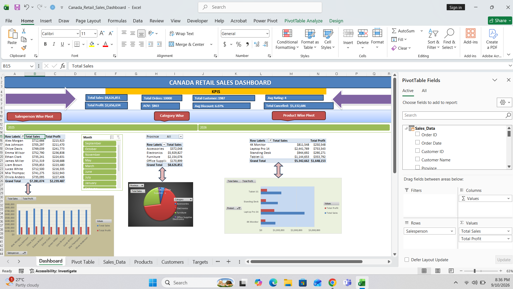
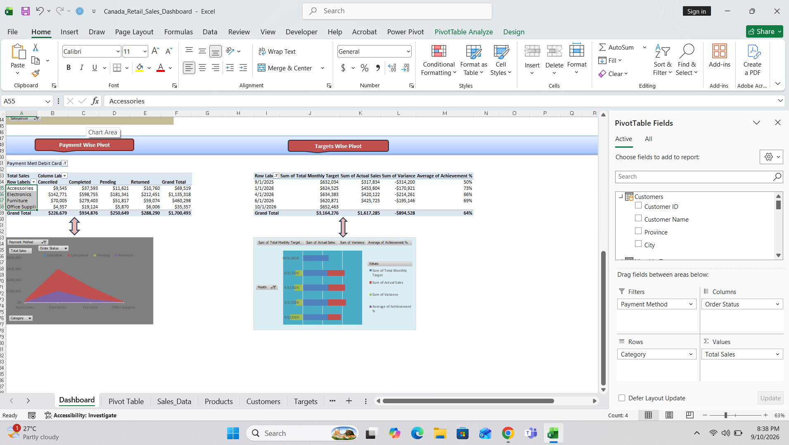

# Canada Retail Sales BI Dashboard (Excel Data Model)

An interactive, multi-sheet Business Intelligence dashboard engineered to analyze retail sales, profitability, order fulfillment profiles, and monthly target achievements for a Canadian retail enterprise. 

This project bypasses volatile layout formulas and macro dependencies, leveraging a native relational database schema directly inside the Excel Data Model to connect over 10,000 retail transaction rows seamlessly.

## 📊 Dashboard Interface Preview

### Top Overview & Sales KPIs

### Fulfillment, Payments & Target Achievement Analytics

## 🔑 Key Features
* **Relational Schema Integration:** Established high-performance data model relationships linking independent source sheets (`Sales_Data`, `Products`, `Customers`, `Targets`, `Monthly_Targets`).
* **Automated Data Pipeline (No Macros):** Converted raw grids into dynamic Excel Tables, allowing automatic boundary expansion to absorb new rows and columns instantly on refresh.
* **Granular Executive KPIs:** Built dedicated card blocks tracking Total Sales ($8.6M), Net Profits ($2.6M), AOV, Order Statuses, and Cancellation Rates.
* **Interactive Timeline Controls:** Configured cross-filtering Month and Year slicers wired via unified report connections to drive simultaneous table updates.
* **Non-Additive Percentage Corrections:** Resolved standard Pivot summary glitches by calculating true performance achievement grand totals across distinct data structures.

## 🛠️ Tech Stack & Methods
* Microsoft Excel (Data Model, Power Pivot, Pivot Tables & Pivot Charts)
* Data Schema Relationships & Cross-Filter Connections
* Advanced Numeric & Currency Formatting
